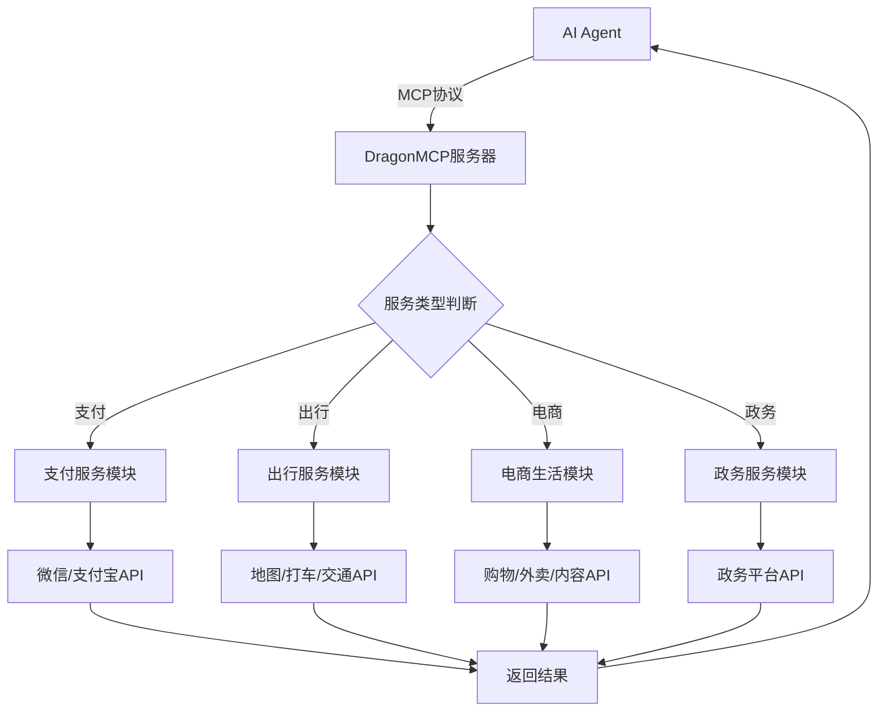

## 1. 产品概述

DragonMCP是一个专为AI Agent设计的Model Context Protocol服务器，提供大中华区本地化生活服务接口。解决AI Agent无法直接调用微信、支付宝等亚洲主流应用的问题，让AI Agent能够便捷地完成支付、出行、购物、政务等日常任务。

目标市场：服务大中华区及亚洲地区的AI Agent开发者和企业用户，填补AI Agent本地化服务集成空白。

## 2. 核心功能

### 2.1 用户角色

| 角色 | 注册方式 | 核心权限 |
|------|----------|----------|
| AI Agent开发者 | API密钥认证 | 调用所有MCP工具接口 |
| 企业用户 | 企业认证+API密钥 | 批量调用、高级配置权限 |
| 个人开发者 | 邮箱注册 | 基础接口调用，有频率限制 |

### 2.2 功能模块

DragonMCP包含以下核心服务模块：

1. **支付服务模块**：微信支付、支付宝支付接口封装
2. **出行服务模块**：地图导航、打车、公共交通查询预订
3. **电商生活模块**：购物平台、外卖、内容管理
4. **政务服务模块**：各地政务平台接口集成
5. **管理控制台**：服务配置、密钥管理、调用监控

### 2.3 服务详情

| 服务类别 | 模块名称 | 功能描述 |
|----------|----------|----------|
| 支付服务 | 微信支付 | 调用微信支付API，支持小程序支付、生活缴费 |
| 支付服务 | 支付宝 | 调用支付宝API，支持小程序场景、账单支付 |
| 出行服务 | 地图导航 | 集成高德地图、百度地图深度操作功能 |
| 出行服务 | 打车服务 | 调用滴滴、美团打车API完成叫车服务 |
| 出行服务 | 公共交通 | 港铁、12306高铁查询与订票功能 |
| 电商生活 | 购物平台 | 淘宝、京东、拼多多、闲鱼商品查询与下单 |
| 电商生活 | 内容管理 | 小红书笔记发布、管理功能 |
| 电商生活 | 外卖服务 | 美团外卖、饿了么订餐功能 |
| 政务服务 | 香港政务 | 香港e-services平台接口调用 |
| 政务服务 | 内地政务 | 粤省事等电子政务平台集成 |
| 管理控制台 | 服务配置 | 配置各平台API密钥和参数 |
| 管理控制台 | 调用监控 | 查看API调用日志和统计 |
| 管理控制台 | 密钥管理 | 生成和管理API访问密钥 |

## 3. 核心流程

### AI Agent服务调用流程
AI Agent通过MCP协议调用DragonMCP服务器，服务器根据请求类型调用相应的本地化服务API，并将结果返回给AI Agent。

## 4. 用户界面设计

### 4.1 设计风格
- **主色调**：科技蓝 (#1890ff) + 深空灰 (#141414)
- **按钮样式**：圆角矩形，扁平化设计
- **字体**：系统默认字体，主要字号14-16px
- **布局风格**：左侧导航 + 右侧内容区的管理后台布局
- **图标风格**：简约线性图标，统一iconfont库

### 4.2 页面设计概述

| 页面名称 | 模块名称 | UI元素 |
|----------|----------|----------|
| 管理控制台 | 服务状态 | 卡片式布局显示各服务运行状态，绿色表示正常，红色表示异常 |
| 管理控制台 | API密钥 | 表格形式展示密钥列表，支持复制和重新生成功能 |
| 管理控制台 | 调用日志 | 时间轴形式展示API调用历史，支持按时间和类型筛选 |
| 服务配置 | 平台配置 | 分组表单设计，每个平台独立配置卡片，包含必填项验证 |
| 服务配置 | 密钥管理 | 密码框输入，支持显示/隐藏，加密存储提示 |

### 4.3 响应式设计
采用桌面端优先设计，适配1280px以上分辨率。管理控制台主要在桌面环境使用，移动端仅提供基础查看功能。

## 5. 安全与隐私

### 5.1 数据安全
- 所有API密钥采用AES-256加密存储
- 支持密钥轮换机制，定期自动更新
- 敏感操作需要二次验证

### 5.2 访问控制
- 基于角色的权限管理（RBAC）
- API调用频率限制，防止滥用
- IP白名单机制，限制访问来源

### 5.3 隐私保护
- 用户数据本地化存储，不出境
- 最小权限原则，只获取必要的用户授权
- 完整的操作审计日志

## 6. 典型使用场景

### 6.1 智能出行助手
**场景描述**：用户让AI Agent帮忙安排从家到机场的行程

**执行流程**：
1. AI Agent调用地图服务查询路线和时间
2. 根据用户偏好选择打车或公共交通
3. 如需打车，调用滴滴/美团API下单
4. 如需公共交通，查询港铁/12306时刻表
5. 返回完整的出行方案给用户

### 6.2 生活缴费助手
**场景描述**：用户让AI Agent帮忙缴纳水电费

**执行流程**：
1. AI Agent调用微信支付/支付宝生活缴费接口
2. 查询用户待缴费账单
3. 确认缴费金额和户号信息
4. 发起支付请求
5. 返回缴费结果和电子凭证

### 6.3 购物比价助手
**场景描述**：用户让AI Agent帮忙找到最优惠的商品

**执行流程**：
1. AI Agent同时在淘宝、京东、拼多多搜索商品
2. 获取各平台的价格、评价、配送信息
3. 综合比较后推荐最优选择
4. 如需购买，调用相应平台下单接口
5. 跟踪订单状态和物流信息

## 7. 技术规格

### 7.1 性能要求
- API响应时间 < 3秒（95%请求）
- 并发处理能力 > 1000 QPS
- 服务可用性 > 99.9%

### 7.2 兼容性要求
- 支持MCP协议1.0版本
- 兼容主流AI Agent框架
- 提供RESTful API作为备选方案

### 7.3 扩展性设计
- 插件化架构，支持新增服务平台
- 配置化管理，无需代码改动即可添加新服务
- 支持多租户架构，服务不同客户群体