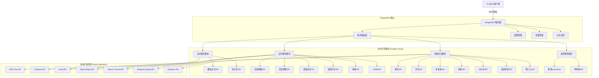
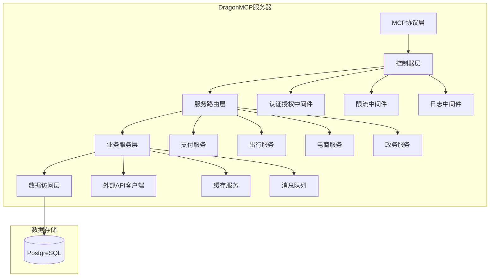
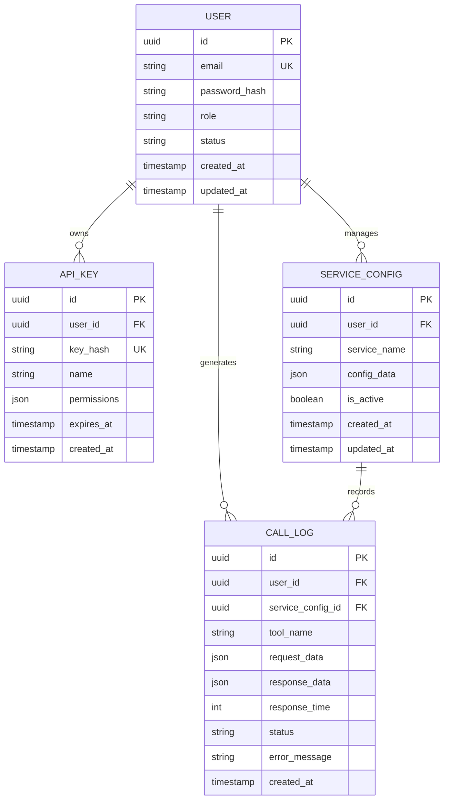

## 1. 架构设计



## 2. 技术描述

- **后端**: Node.js@20 + Express@4 + TypeScript
- **MCP协议**: @modelcontextprotocol/sdk@1.0
- **数据库**: Supabase (PostgreSQL@15)
- **缓存**: Redis@7
- **消息队列**: Bull@4 + Redis
- **监控**: Winston@3 + Prometheus
- **初始化工具**: npm-init

## 3. 路由定义

| 路由 | 用途 |
|------|------|
| /mcp/tools | MCP工具列表接口 |
| /mcp/call | MCP工具调用接口 |
| /api/config | 服务配置管理接口 |
| /api/keys | API密钥管理接口 |
| /api/logs | 调用日志查询接口 |
| /health | 健康检查接口 |

## 4. API定义

### 4.1 MCP工具调用API

```
POST /mcp/call
```

请求参数：
| 参数名 | 参数类型 | 是否必需 | 描述 |
|--------|----------|----------|------|
| tool | string | true | 工具名称 |
| arguments | object | true | 工具参数 |
| context | object | false | 调用上下文 |

响应参数：
| 参数名 | 参数类型 | 描述 |
|--------|----------|------|
| result | object | 调用结果 |
| status | string | 调用状态 |
| error | string | 错误信息 |

示例：
```json
{
  "tool": "wechat_pay",
  "arguments": {
    "amount": 100,
    "description": "生活缴费"
  }
}
```

### 4.2 服务配置API

```
GET /api/config/:service
```

路径参数：
| 参数名 | 参数类型 | 是否必需 | 描述 |
|--------|----------|----------|------|
| service | string | true | 服务名称 |

响应参数：
| 参数名 | 参数类型 | 描述 |
|--------|----------|------|
| config | object | 服务配置信息 |
| status | string | 配置状态 |

## 5. 服务器架构



## 6. 数据模型

### 6.1 数据模型定义



### 6.2 数据定义语言

用户表（users）
```sql
-- 创建用户表
CREATE TABLE users (
    id UUID PRIMARY KEY DEFAULT gen_random_uuid(),
    email VARCHAR(255) UNIQUE NOT NULL,
    password_hash VARCHAR(255) NOT NULL,
    role VARCHAR(50) DEFAULT 'developer' CHECK (role IN ('developer', 'enterprise', 'admin')),
    status VARCHAR(50) DEFAULT 'active' CHECK (status IN ('active', 'inactive', 'suspended')),
    created_at TIMESTAMP WITH TIME ZONE DEFAULT NOW(),
    updated_at TIMESTAMP WITH TIME ZONE DEFAULT NOW()
);

-- 创建索引
CREATE INDEX idx_users_email ON users(email);
CREATE INDEX idx_users_status ON users(status);
```

API密钥表（api_keys）
```sql
-- 创建API密钥表
CREATE TABLE api_keys (
    id UUID PRIMARY KEY DEFAULT gen_random_uuid(),
    user_id UUID NOT NULL REFERENCES users(id) ON DELETE CASCADE,
    key_hash VARCHAR(255) UNIQUE NOT NULL,
    name VARCHAR(100) NOT NULL,
    permissions JSONB DEFAULT '{}',
    expires_at TIMESTAMP WITH TIME ZONE,
    created_at TIMESTAMP WITH TIME ZONE DEFAULT NOW()
);

-- 创建索引
CREATE INDEX idx_api_keys_user_id ON api_keys(user_id);
CREATE INDEX idx_api_keys_key_hash ON api_keys(key_hash);
```

服务配置表（service_configs）
```sql
-- 创建服务配置表
CREATE TABLE service_configs (
    id UUID PRIMARY KEY DEFAULT gen_random_uuid(),
    user_id UUID NOT NULL REFERENCES users(id) ON DELETE CASCADE,
    service_name VARCHAR(100) NOT NULL,
    config_data JSONB NOT NULL DEFAULT '{}',
    is_active BOOLEAN DEFAULT true,
    created_at TIMESTAMP WITH TIME ZONE DEFAULT NOW(),
    updated_at TIMESTAMP WITH TIME ZONE DEFAULT NOW(),
    UNIQUE(user_id, service_name)
);

-- 创建索引
CREATE INDEX idx_service_configs_user_id ON service_configs(user_id);
CREATE INDEX idx_service_configs_service_name ON service_configs(service_name);
```

调用日志表（call_logs）
```sql
-- 创建调用日志表
CREATE TABLE call_logs (
    id UUID PRIMARY KEY DEFAULT gen_random_uuid(),
    user_id UUID NOT NULL REFERENCES users(id) ON DELETE CASCADE,
    service_config_id UUID REFERENCES service_configs(id) ON DELETE SET NULL,
    tool_name VARCHAR(200) NOT NULL,
    request_data JSONB NOT NULL DEFAULT '{}',
    response_data JSONB DEFAULT '{}',
    response_time INTEGER DEFAULT 0,
    status VARCHAR(50) NOT NULL CHECK (status IN ('success', 'failed', 'timeout')),
    error_message TEXT,
    created_at TIMESTAMP WITH TIME ZONE DEFAULT NOW()
);

-- 创建索引
CREATE INDEX idx_call_logs_user_id ON call_logs(user_id);
CREATE INDEX idx_call_logs_tool_name ON call_logs(tool_name);
CREATE INDEX idx_call_logs_created_at ON call_logs(created_at DESC);
CREATE INDEX idx_call_logs_status ON call_logs(status);
```

### 6.3 权限设置

```sql
-- 授予匿名用户基本访问权限
GRANT SELECT ON users TO anon;
GRANT SELECT ON service_configs TO anon;

-- 授予认证用户完整访问权限
GRANT ALL PRIVILEGES ON users TO authenticated;
GRANT ALL PRIVILEGES ON api_keys TO authenticated;
GRANT ALL PRIVILEGES ON service_configs TO authenticated;
GRANT ALL PRIVILEGES ON call_logs TO authenticated;

-- 创建行级安全策略
ALTER TABLE users ENABLE ROW LEVEL SECURITY;
ALTER TABLE api_keys ENABLE ROW LEVEL SECURITY;
ALTER TABLE service_configs ENABLE ROW LEVEL SECURITY;
ALTER TABLE call_logs ENABLE ROW LEVEL SECURITY;

-- 用户只能访问自己的数据
CREATE POLICY users_policy ON users FOR ALL TO authenticated USING (auth.uid() = id);
CREATE POLICY api_keys_policy ON api_keys FOR ALL TO authenticated USING (auth.uid() = user_id);
CREATE POLICY service_configs_policy ON service_configs FOR ALL TO authenticated USING (auth.uid() = user_id);
CREATE POLICY call_logs_policy ON call_logs FOR ALL TO authenticated USING (auth.uid() = user_id);
```

## 7. 核心依赖配置

### 7.1 主要依赖包
```json
{
  "dependencies": {
    "@modelcontextprotocol/sdk": "^1.0.0",
    "express": "^4.18.2",
    "cors": "^2.8.5",
    "helmet": "^7.0.0",
    "winston": "^3.10.0",
    "@supabase/supabase-js": "^2.38.0",
    "redis": "^4.6.0",
    "bull": "^4.11.0",
    "axios": "^1.5.0",
    "crypto-js": "^4.1.1",
    "joi": "^17.9.0",
    "dotenv": "^16.3.0"
  },
  "devDependencies": {
    "@types/express": "^4.17.17",
    "@types/cors": "^2.8.13",
    "@types/node": "^20.5.0",
    "typescript": "^5.2.0",
    "nodemon": "^3.0.0",
    "jest": "^29.6.0"
  }
}
```

### 7.2 环境变量配置
```bash
# 数据库配置
SUPABASE_URL=your_supabase_url
SUPABASE_ANON_KEY=your_supabase_anon_key
SUPABASE_SERVICE_KEY=your_supabase_service_key

# Redis配置
REDIS_URL=redis://localhost:6379
REDIS_PASSWORD=your_redis_password

# 服务端口
PORT=3000
NODE_ENV=production

# 安全配置
JWT_SECRET=your_jwt_secret
ENCRYPTION_KEY=your_encryption_key

# 外部API配置 (大中华区)
WECHAT_APP_ID=your_wechat_app_id
WECHAT_APP_SECRET=your_wechat_app_secret
ALIPAY_APP_ID=your_alipay_app_id
AMAP_API_KEY=your_amap_api_key

# 外部API配置 (亚洲扩展)
GRAB_API_KEY=your_grab_api_key
LINE_PAY_CHANNEL_ID=your_line_channel_id
NAVER_CLIENT_ID=your_naver_client_id
```
