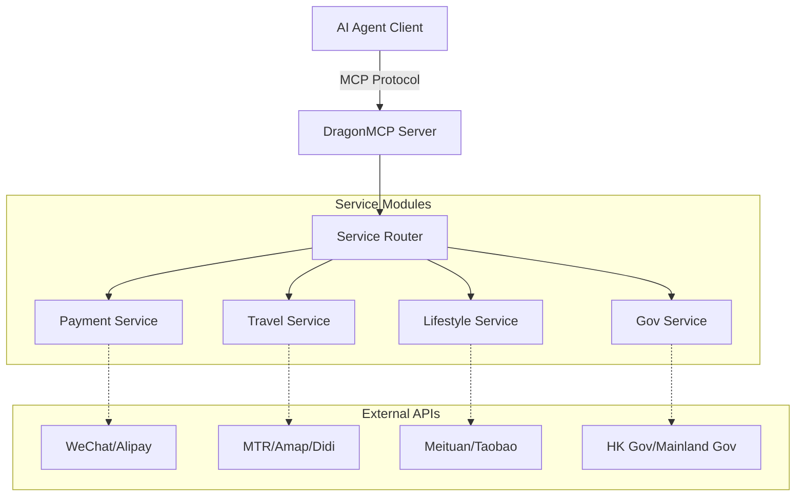

<div align="center">
  

  # DragonMCP

  **The Neural Center for Chinese Local Life Agents**
  
  **中文生活 Agent 的神经中枢**

  Let Claude / DeepSeek / Qwen directly order your takeout, hail a Didi, check high-speed rail tickets, and pay utility bills.
  
  让 Claude / DeepSeek / Qwen 直接帮你点外卖、叫滴滴、查高铁余票、缴水电费。

  [Product Requirements (PRD)](.trae/documents/dragon_mcp_prd.md) • [Architecture](.trae/documents/dragon_mcp_technical_architecture.md) • [Contributing](#-contributing--贡献指南)

  [](https://opensource.org/licenses/MIT)
  [](https://www.typescriptlang.org/)
  [](https://modelcontextprotocol.io/)
  [](https://nodejs.org/)
  [](https://github.com/arthurpanhku/DragonMCP/pulls)
</div>

<a href="https://glama.ai/mcp/servers/arthurpanhku/dragon-mcp">
  
</a>

---

## 🌟 What is DragonMCP? / 项目简介

DragonMCP is a Model Context Protocol (MCP) server designed to bridge the gap between AI Agents and local life services in **Greater China (Mainland China, Hong Kong) and Asia**.

DragonMCP 是一个专为 AI Agent 设计的 Model Context Protocol (MCP) 服务器，旨在打通 AI Agent 与**大中华区（中国内地、香港）及亚洲地区**本地生活服务之间的最后一公里。

---

## 🔥 Live Demo: MTR Real-time Schedule / 实战演示：港铁实时班次

We have implemented the **MTR (Mass Transit Railway) Query Tool** as our first MVP. AI Agents can now fetch real-time train schedules directly from MTR's Open API.

作为第一个 MVP（最小可行性产品），我们已经实现了**港铁（MTR）实时查询工具**。AI Agent 现在可以直接调用港铁开放 API 获取实时列车班次。

**Scenario / 场景**:
> User: "When is the next train from Admiralty to Central?"
> 
> 用户：“从金钟到中环的下一班车还有多久？”

**Agent Response / Agent 回复**:
> "Next Island Line train from Admiralty to Central (towards Kennedy Town):
> - Arriving in: 2 min(s) (10:30:00)
> - Subsequent trains: 5 min(s) (10:33:00)"

*(Try it yourself by connecting DragonMCP to your MCP client! / 快连接 DragonMCP 亲自试一试吧！)*

---

## 🏗️ Architecture / 架构设计

DragonMCP acts as a middleware between AI Agents and various local service APIs.

DragonMCP 作为 AI Agent 与各类本地服务 API 之间的中间件。



For more details, please refer to the [Technical Architecture Document](.trae/documents/dragon_mcp_technical_architecture.md).
更多详情请参阅 [技术架构文档](.trae/documents/dragon_mcp_technical_architecture.md)。

---

## 🗺️ Roadmap & Features / 路线图与功能

### Phase 1: MVP (Current) / 第一阶段：MVP（进行中）
- [x] **Core Framework**: Express + MCP SDK + TypeScript setup.
- [x] **Travel (MTR)**: Real-time schedule query for Island Line & Tsuen Wan Line.
- [ ] **Food Delivery (Demo)**: Simulate ordering process (Search Shop -> Menu -> Cart).
- [ ] **Basic Config**: Environment variables & project structure.

### Phase 2: Expansion / 第二阶段：拓展
- [ ] **Payment Integration**: WeChat Pay / Alipay (Sandbox/QR Code generation).
- [ ] **More Transport**: High Speed Rail (12306) ticket check, Didi/Uber estimation.
- [ ] **E-commerce**: Product search aggregation (Taobao/JD).
- [ ] **Multi-region Support**: Switch context between Mainland China / HK / SG.

### Phase 3: Ecosystem / 第三阶段：生态
- [ ] **Plugin System**: Allow community to contribute individual service tools.
- [ ] **User Auth**: Secure user token management for personal services.

---

## 🚀 Getting Started / 快速开始

### Prerequisites / 前置要求
*   Node.js >= 18
*   npm or yarn

### Installation / 安装

1.  Clone the repository / 克隆仓库:
    ```bash
    git clone https://github.com/arthurpanhku/DragonMCP.git
    cd DragonMCP
    ```

2.  Install dependencies / 安装依赖:
    ```bash
    npm install
    ```

3.  Configure environment variables / 配置环境变量:
    ```bash
    cp .env.example .env
    # Edit .env if necessary (MTR API requires no key currently)
    # 编辑 .env 文件（目前 MTR API 无需密钥）
    ```

### Running the Server / 运行服务器

Start the development server with SSE support / 启动支持 SSE 的开发服务器:

```bash
npm run server:dev
```

The server will start at `http://localhost:3000`.
SSE Endpoint: `http://localhost:3000/mcp/sse`

### Connect to Claude Desktop / 连接到 Claude Desktop

Add the following to your `claude_desktop_config.json`:
在您的 `claude_desktop_config.json` 中添加以下内容：

```json
{
  "mcpServers": {
    "DragonMCP": {
      "command": "node",
      "args": ["/path/to/DragonMCP/api/dist/index.js"], 
      "env": {
        "NODE_ENV": "production"
      }
    }
  }
}
```
*(Note: For local dev, you might need to build first or point to the ts-node wrapper / 注意：本地开发可能需要先构建或指向 ts-node 包装器)*

---

## 🧪 Testing / 测试

Run unit and integration tests / 运行单元测试和集成测试:

```bash
# Enable experimental VM modules for Jest (ESM support)
# 开启 Jest 的实验性 VM 模块支持以兼容 ESM
NODE_OPTIONS="$NODE_OPTIONS --experimental-vm-modules" npm test
```

---

## 🤝 Contributing / 贡献指南

We welcome all contributions! Whether you are a developer, designer, or product thinker.
我们热烈欢迎所有贡献！无论你是开发者、设计师还是产品思考者。

### We need help with / 我们急需：
1.  **Playwright Scripts**: Simulating food delivery apps (Meituan/Ele.me) web flows. / 模拟外卖平台（美团/饿了么）网页流程。
2.  **More MTR Lines**: Adding station data for East Rail Line, Tuen Ma Line, etc. / 补充东铁线、屯马线等站点数据。
3.  **Docs**: Translating docs to other languages. / 翻译文档。

See [CONTRIBUTING.md](CONTRIBUTING.md) (Coming Soon) for details.

---

## 📄 License / 许可证

This project is licensed under the MIT License - see the [LICENSE](LICENSE) file for details.
本项目采用 MIT 许可证 - 详情请参阅 [LICENSE](LICENSE) 文件。