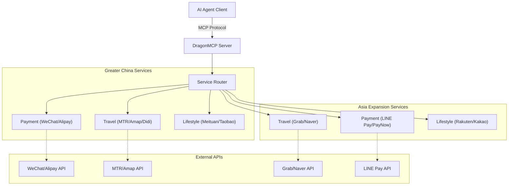

<div align="center">
  

  # DragonMCP

  **The Neural Center for Chinese Local Life Agents**

  [English](README.md) | [简体中文](README_zh-CN.md) | [日本語](README_ja.md) | [한국어](README_ko.md) | [Français](README_fr.md) | [Deutsch](README_de.md)

  Let Claude / DeepSeek / Qwen directly order your takeout, hail a Didi, check high-speed rail tickets, and pay utility bills.

  [Architecture](#-architecture) • [Contributing Guide](CONTRIBUTING.md)

  [](https://opensource.org/licenses/MIT)
  [](https://www.typescriptlang.org/)
  [](https://modelcontextprotocol.io/)
  [](https://nodejs.org/)
  [](https://github.com/arthurpanhku/DragonMCP/pulls)
</div>

---

## 🌟 What is DragonMCP?

DragonMCP is a Model Context Protocol (MCP) server designed to bridge the gap between AI Agents and local life services in **Greater China (Mainland China, Hong Kong) and Asia**.

It aims to solve the "last mile" problem between AI Agents and real-world services.

---

## 🔥 Live Demo: MTR Real-time Schedule

We have implemented the **MTR (Mass Transit Railway) Query Tool** as our first MVP. AI Agents can now fetch real-time train schedules directly from MTR's Open API.

**Scenario**:
> User: "When is the next train from Admiralty to Central?"

**Agent Response**:
> "Next Island Line train from Admiralty to Central (towards Kennedy Town):
> - Arriving in: 2 min(s) (10:30:00)
> - Subsequent trains: 5 min(s) (10:33:00)"

*(Try it yourself by connecting DragonMCP to your MCP client!)*

---

## 🛠️ Supported Services (Beta)

We are actively expanding our support for local services. Below are the currently integrated interfaces (some are mocks/placeholders for development):

| Region             | Category      | Service              | Tool Name                | Description                                      | Status |
| :----------------- | :------------ | :------------------- | :----------------------- | :----------------------------------------------- | :----- |
| **Greater China**  | **Travel**    | **MTR (HK)**         | `search_mtr_schedule`    | Real-time train schedule (Island/Tsuen Wan Line) | ✅ Live |
|                    |               | **Amap (Gaode)**     | `amap_search_poi`        | Search for POIs (Restaurants, Hotels, etc.)      | ✅ Live |
|                    |               | **Amap (Gaode)**     | `amap_walking_direction` | Walking route planning                           | ✅ Live |
|                    |               | **Amap (Gaode)**     | `amap_driving_direction` | Driving route planning (Fastest)                 | ✅ Live |
|                    |               | **Amap (Gaode)**     | `amap_transit_direction` | Public transit route planning (Integrated)       | ✅ Live |
|                    | **Weather**   | **HK Observatory**   | `hk_weather_current`     | Current weather report in Hong Kong              | ✅ Live |
|                    | **Travel**    | **Didi**             | `book_taxi_didi`         | Estimate price and book a ride                   | 🚧 Mock |
|                    | **Payment**   | **WeChat Pay**       | `wechat_pay_create`      | Create payment order                             | 🚧 Mock |
|                    |               | **Alipay**           | `alipay_pay_create`      | Create payment order                             | 🚧 Mock |
|                    | **Lifestyle** | **Meituan**          | `meituan_search_food`    | Search for food delivery                         | 🚧 Mock |
|                    | **Shopping**  | **Taobao**           | `taobao_search_product`  | Search for products                              | 🚧 Mock |
| **Asia Expansion** | **Travel**    | **Grab (SG/SEA)**    | `book_ride_grab`         | Estimate and book a ride                         | 🚧 Mock |
|                    |               | **Naver Maps (KR)**  | `naver_map_search`       | Search for places in Korea                       | 🚧 Mock |
|                    | **Payment**   | **LINE Pay (JP/TW)** | `line_pay_request`       | Request a payment                                | 🚧 Mock |

---

## ⚠️ Security & Disclaimer

> **IMPORTANT**: This project includes Mock implementations for sensitive services like payments (WeChat Pay, Alipay) and ride-hailing (Didi).

*   **Do NOT** use real financial data or personal credentials in the current version.
*   The payment tools (`wechat_pay_create`, `alipay_pay_create`) currently return **fake data** for demonstration purposes only. No actual money is transferred.
*   When integrating real APIs in the future, ensure you follow strict security protocols (OAuth, HTTPS, Token Management).

---

## 🏗️ Architecture

DragonMCP acts as a middleware between AI Agents and various local service APIs.



Architecture details are documented in this README and will be expanded in repo docs over time.

---

## 🗺️ Roadmap & Features

### Phase 1: MVP (Current)
- [x] **Core Framework**: Express + MCP SDK + TypeScript setup.
- [x] **Travel (MTR)**: Real-time schedule query for Island Line & Tsuen Wan Line.
- [x] **Travel (Amap)**: POI search and walking directions.
- [x] **Service Mocks**: Basic structure for WeChat/Alipay/Didi/Meituan/Taobao.
- [ ] **Food Delivery (Demo)**: Simulate ordering process (Search Shop -> Menu -> Cart).
- [ ] **Basic Config**: Environment variables & project structure.

### Phase 2: Asia Expansion (New!)
- [x] **Structure Setup**: Service directories for Singapore (Grab), Japan (LINE), Korea (Naver).
- [x] **Initial Mocks**: Grab ride booking, LINE Pay request, Naver Map search.
- [ ] **Real API Integration**: Replace mocks with real APIs (Grab Developer, LINE Pay API).
- [ ] **More Services**: Kakao Pay (KR), Yahoo! Transit (JP), EZ-Link (SG).

### Phase 3: Ecosystem
- [ ] **Plugin System**: Allow community to contribute individual service tools.
- [ ] **User Auth**: Secure user token management for personal services.

---

## 🚀 Getting Started

### Prerequisites
*   Node.js >= 18
*   npm or yarn

### Installation

1.  Clone the repository:
    ```bash
    git clone https://github.com/arthurpanhku/DragonMCP.git
    cd DragonMCP
    ```

2.  Install dependencies:
    ```bash
    npm install
    ```

3.  Configure environment variables:
    ```bash
    cp .env.example .env
    # Edit .env (AMAP_API_KEY required for map services)
    ```

   Minimum recommended variables:
   - `AMAP_API_KEY`: required for Amap search and routing tools.
   - `JWT_SECRET` and `ENCRYPTION_KEY`: required when `NODE_ENV=production`.

### Running the Server

Start the development server with SSE support:

```bash
npm run dev
```

The server will start at `http://localhost:3000`.
SSE Endpoint: `http://localhost:3000/mcp/sse`

### Running with Docker

1.  Build and start the container:
    ```bash
    docker-compose up -d --build
    ```

2.  View logs:
    ```bash
    docker-compose logs -f
    ```

3.  Stop the server:
    ```bash
    docker-compose down
    ```

### Connect to Claude Desktop

1.  Build the project:
    ```bash
    npm run build
    ```

2.  Add the following to your `claude_desktop_config.json`:

    ```json
    {
      "mcpServers": {
        "DragonMCP": {
          "command": "node",
          "args": ["/path/to/DragonMCP/dist/server.js"], 
          "env": {
            "NODE_ENV": "production",
            "AMAP_API_KEY": "your_amap_api_key_here"
          }
        }
      }
    }
    ```
    *(Note: Replace `/path/to/DragonMCP` with your actual absolute path)*

---

## ❓ FAQ & Troubleshooting

### Q: Why do I get "Station not found" for MTR query?
A: Currently, only **Island Line** and **Tsuen Wan Line** are supported. Please check if the station name is spelled correctly (e.g., "Admiralty", "Central", "Mong Kok").

### Q: How do I get an Amap (Gaode) API Key?
A: You need to register at the [Amap Open Platform](https://lbs.amap.com/), create a "Web Service" application, and copy the Key to your `.env` file as `AMAP_API_KEY`.

### Q: Can I use this for real payments?
A: **No.** The current payment tools are mocks. Do not use them for real transactions.

---

## 🧪 Testing

Run unit and integration tests:

```bash
npm test
```

If your local Node/Jest setup requires ESM flags, you can run:

```bash
NODE_OPTIONS="$NODE_OPTIONS --experimental-vm-modules" npm test
```

---

## 🤝 Contributing

We welcome all contributions! Whether you are a developer, designer, or product thinker.

### We need help with:
1.  **Playwright Scripts**: Simulating food delivery apps (Meituan/Ele.me) web flows.
2.  **More MTR Lines**: Adding station data for East Rail Line, Tuen Ma Line, etc.
3.  **Real API Integration**: Replacing mocks with real APIs for WeChat/Alipay/Didi.

See [CONTRIBUTING.md](CONTRIBUTING.md) for details.

---

## 🙏 Acknowledgments

*   **Anthropic**: For creating the Model Context Protocol (MCP).
*   **MTR Corporation**: For providing the Open Data API.
*   **Amap (Gaode)**: For the map and POI services.

---

## 📄 License

This project is licensed under the MIT License - see the [LICENSE](LICENSE) file for details.

## Hosted deployment

A hosted deployment is available on [Fronteir AI](https://fronteir.ai/mcp/arthurpanhku-dragonmcp).

