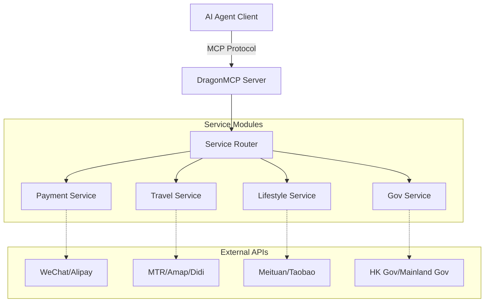

<div align="center">
  

  # DragonMCP

  **The Neural Center for Chinese Local Life Agents**

  [English](README.md) | [简体中文](README_zh-CN.md) | [日本語](README_ja.md) | [한국어](README_ko.md) | [Français](README_fr.md) | [Deutsch](README_de.md)

  Let Claude / DeepSeek / Qwen directly order your takeout, hail a Didi, check high-speed rail tickets, and pay utility bills.

  [Product Requirements (PRD)](.trae/documents/dragon_mcp_prd.md) • [Architecture](.trae/documents/dragon_mcp_technical_architecture.md) • [Contributing](#-contributing)

  [](https://opensource.org/licenses/MIT)
  [](https://www.typescriptlang.org/)
  [](https://modelcontextprotocol.io/)
  [](https://nodejs.org/)
  [](https://github.com/arthurpanhku/DragonMCP/pulls)
</div>

---

## 🌟 What is DragonMCP?

DragonMCP is a Model Context Protocol (MCP) server designed to bridge the gap between AI Agents and local life services in **Greater China (Mainland China, Hong Kong) and Asia**.

It aims to solve the "last mile" problem between AI Agents and real-world services.

---

## 🔥 Live Demo: MTR Real-time Schedule

We have implemented the **MTR (Mass Transit Railway) Query Tool** as our first MVP. AI Agents can now fetch real-time train schedules directly from MTR's Open API.

**Scenario**:
> User: "When is the next train from Admiralty to Central?"

**Agent Response**:
> "Next Island Line train from Admiralty to Central (towards Kennedy Town):
> - Arriving in: 2 min(s) (10:30:00)
> - Subsequent trains: 5 min(s) (10:33:00)"

*(Try it yourself by connecting DragonMCP to your MCP client!)*

---

## 🏗️ Architecture

DragonMCP acts as a middleware between AI Agents and various local service APIs.



For more details, please refer to the [Technical Architecture Document](.trae/documents/dragon_mcp_technical_architecture.md).

---

## 🗺️ Roadmap & Features

### Phase 1: MVP (Current)
- [x] **Core Framework**: Express + MCP SDK + TypeScript setup.
- [x] **Travel (MTR)**: Real-time schedule query for Island Line & Tsuen Wan Line.
- [ ] **Food Delivery (Demo)**: Simulate ordering process (Search Shop -> Menu -> Cart).
- [ ] **Basic Config**: Environment variables & project structure.

### Phase 2: Expansion
- [ ] **Payment Integration**: WeChat Pay / Alipay (Sandbox/QR Code generation).
- [ ] **More Transport**: High Speed Rail (12306) ticket check, Didi/Uber estimation.
- [ ] **E-commerce**: Product search aggregation (Taobao/JD).
- [ ] **Multi-region Support**: Switch context between Mainland China / HK / SG.

### Phase 3: Ecosystem
- [ ] **Plugin System**: Allow community to contribute individual service tools.
- [ ] **User Auth**: Secure user token management for personal services.

---

## 🚀 Getting Started

### Prerequisites
*   Node.js >= 18
*   npm or yarn

### Installation

1.  Clone the repository:
    ```bash
    git clone https://github.com/arthurpanhku/DragonMCP.git
    cd DragonMCP
    ```

2.  Install dependencies:
    ```bash
    npm install
    ```

3.  Configure environment variables:
    ```bash
    cp .env.example .env
    # Edit .env if necessary (MTR API requires no key currently)
    ```

### Running the Server

Start the development server with SSE support:

```bash
npm run server:dev
```

The server will start at `http://localhost:3000`.
SSE Endpoint: `http://localhost:3000/mcp/sse`

### Connect to Claude Desktop

Add the following to your `claude_desktop_config.json`:

```json
{
  "mcpServers": {
    "DragonMCP": {
      "command": "node",
      "args": ["/path/to/DragonMCP/api/dist/index.js"], 
      "env": {
        "NODE_ENV": "production"
      }
    }
  }
}
```
*(Note: For local dev, you might need to build first or point to the ts-node wrapper)*

---

## 🧪 Testing

Run unit and integration tests:

```bash
# Enable experimental VM modules for Jest (ESM support)
NODE_OPTIONS="$NODE_OPTIONS --experimental-vm-modules" npm test
```

---

## 🤝 Contributing

We welcome all contributions! Whether you are a developer, designer, or product thinker.

### We need help with:
1.  **Playwright Scripts**: Simulating food delivery apps (Meituan/Ele.me) web flows.
2.  **More MTR Lines**: Adding station data for East Rail Line, Tuen Ma Line, etc.
3.  **Docs**: Translating docs to other languages.

See [CONTRIBUTING.md](CONTRIBUTING.md) (Coming Soon) for details.

---

## 📄 License

This project is licensed under the MIT License - see the [LICENSE](LICENSE) file for details.
