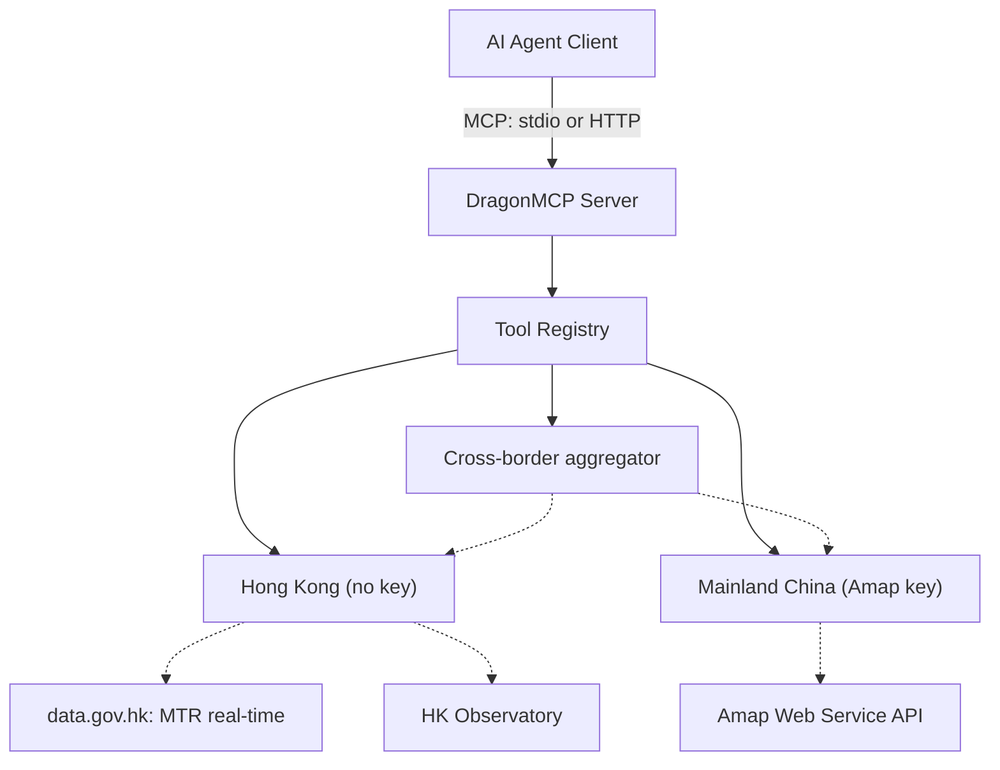

<div align="center">
  

  # DragonMCP

  **Hong Kong & cross-border open data for AI Agents**

  [English](README.md) | [简体中文](README_zh-CN.md)

  Live MTR arrivals, HK Observatory weather, and Mainland China routing — over the Model Context Protocol.

  [Quickstart](#-quickstart) • [Tools](#-tools) • [Limitations](#-limitations) • [Roadmap](#-roadmap)

  [](https://opensource.org/licenses/MIT)
  [](https://www.typescriptlang.org/)
  [](https://modelcontextprotocol.io/)
  [](https://nodejs.org/)
</div>

---

## 🌟 What is DragonMCP?

An MCP server that gives AI agents **real, verifiable public data** for Hong Kong and the Mainland China border region.

**Every tool in this server calls a live API. There are no mocks.** If an upstream source is down, the tool says so — it never invents a plausible-looking answer. You can verify this yourself at any time with the built-in `system_run_selftest` tool, which pings every upstream and reports what is actually reachable.

Why this niche: Hong Kong's public data is genuinely open (`data.gov.hk`, no keys, no rate-limit paperwork) but scattered across agencies with inconsistent formats. And cross-border trips — where a single journey spans MTR, the Mainland rail network, and two different weather authorities — are exactly the case no single agency has any incentive to serve.

---

## 🔥 Live example

**MTR real-time arrivals** — no API key required:

```
> When is the next train from Admiralty to Central?

Next Island Line train from Admiralty to Central (towards Kennedy Town):
- Arriving in: 0 min(s) (14:02:27)
Subsequent trains:
- 4 min(s) (14:06:27)
- 7 min(s) (14:09:27)
```

**Hong Kong Observatory** — no API key required, includes active warnings:

```
> What's the weather in Hong Kong?

Current Weather in Hong Kong (Updated: 2026-08-04T13:02:00+08:00):
- Temperature: 30°C
- Humidity: 75%
- UV Index: 8 (very high)

Warnings:
The Thunderstorm Warning has been issued. It will remain effective until
3:00 p.m. today. Isolated thunderstorms are expected to occur over New
Territories West.
```

---

## 🛠️ Tools

| Tool | Source | API key | What it does |
| :--- | :--- | :--- | :--- |
| `search_mtr_schedule` | MTR via data.gov.hk | — | Real-time arrivals between two stations, **all 10 lines** |
| `hk_weather_current` | HK Observatory | — | Current conditions + active warnings |
| `search_transit_route` | MTR / Amap | CN only | Unified HK/CN routing; picks the right provider |
| `system_run_selftest` | all of the above | — | Live reachability check of every upstream |
| `amap_search_poi` | Amap (Gaode) | ✅ | POI search in Mainland China |
| `amap_walking_direction` | Amap (Gaode) | ✅ | Walking route |
| `amap_driving_direction` | Amap (Gaode) | ✅ | Driving route |
| `amap_transit_direction` | Amap (Gaode) | ✅ | Public transit route |
| `amap_bicycling_direction` | Amap (Gaode) | ✅ | Cycling route |

**MTR coverage** — all 10 lines, station names accepted in English or Chinese:

Island (港岛线) · Tsuen Wan (荃湾线) · Kwun Tong (观塘线) · Tseung Kwan O (将军澳线) · **East Rail (东铁线, runs to Lo Wu 罗湖 and Lok Ma Chau 落马洲)** · Tuen Ma (屯马线) · South Island (南港岛线) · Tung Chung (东涌线) · Airport Express (机场快线) · Disneyland Resort (迪士尼线)

---

## ⚠️ Limitations

Stated up front, because a tool that hides its limits is a tool that lies to your agent:

- **No MTR transfer planning.** Direct routes only. Two stations that don't share a line return an explicit "no direct line found", not a guess.
- **East Rail and Tseung Kwan O branch handling is simplified.** Both lines split (LOW/LMC, LHP/POA); the server picks the main branch.
- **Amap tools need your own key** and cover Mainland China only.
- **Cross-border journey planning is not built yet.** East Rail reaches the border stations, but stitching a full HK→Shenzhen itinerary is Stage 2 on the roadmap.

---

## 🚀 Quickstart

**Prerequisites:** Node.js >= 18

```bash
git clone https://github.com/arthurpanhku/DragonMCP.git
cd DragonMCP
npm install
npm run build
```

No `.env` is needed for the Hong Kong tools. For the Amap tools, copy the template and add your key:

```bash
cp .env.example .env
```

### Connect to Claude Desktop

Add to `claude_desktop_config.json`:

```json
{
  "mcpServers": {
    "DragonMCP": {
      "command": "node",
      "args": ["/absolute/path/to/DragonMCP/dist/stdio.js"]
    }
  }
}
```

Add `"env": { "AMAP_API_KEY": "your_key" }` only if you want the Mainland China tools.

### Other ways to run

```bash
npm run dev:stdio   # stdio transport, for local MCP clients
npm run dev         # HTTP server: Streamable HTTP at /mcp, legacy SSE at /mcp/sse
docker-compose up -d --build
```

In stdio mode, stdin/stdout carry MCP JSON-RPC; diagnostics go to stderr so the protocol stream stays clean.

---

## 🏗️ Architecture


```mermaid
graph TD
    A[AI Agent Client] -->|MCP: stdio or HTTP| B[DragonMCP Server]
    B --> C[Tool Registry]

    C --> D["Hong Kong (no key)"]
    C --> E["Mainland China (Amap key)"]
    C --> F["Cross-border aggregator"]

    D -.-> G[data.gov.hk: MTR real-time]
    D -.-> H[HK Observatory]
    E -.-> I[Amap Web Service API]
    F -.-> D
    F -.-> E
```

---

## 🗺️ Roadmap

**Stage 1 — Provenance & zero-config**
- [ ] Every tool response carries `source`, `fetched_at`, `freshness`
- [ ] Publish to npm so `npx dragon-mcp` works with no clone and no key
- [ ] Daily CI self-test with a status badge, so "the data sources are alive today" is publicly verifiable

**Stage 2 — Cross-border**
- [ ] MTR transfer planning
- [ ] Border checkpoints, Guangzhou–Shenzhen–Hong Kong Express Rail, Airport Express integration
- [ ] `plan_cross_border_trip`: one call spanning both sides of the boundary

**Stage 3 — Coverage**
- [ ] More `data.gov.hk` sources (bus/ferry ETAs, typhoon signals, air quality)
- [ ] Macau

---

## 🧪 Testing

```bash
npm test          # unit + integration; hermetic, no network required
npm run check     # typecheck
npm run lint
```

To verify live upstreams instead, call the `system_run_selftest` tool from any MCP client.

---

## 🤝 Contributing

See [CONTRIBUTING.md](CONTRIBUTING.md).

**One hard rule: no mock tools.** A tool that returns fabricated data is worse than a missing tool, because the agent cannot tell the difference. If an upstream API isn't available, the right move is not to register the tool.

Good places to start: MTR transfer planning, additional `data.gov.hk` sources, branch handling for East Rail and Tseung Kwan O.

---

## 🙏 Acknowledgments

*   **Anthropic** — for the Model Context Protocol
*   **MTR Corporation** and **data.gov.hk** — for the open real-time transit API
*   **Hong Kong Observatory** — for the open weather API
*   **Amap (Gaode)** — for maps and routing

---

## 📄 License

MIT — see [LICENSE](LICENSE).
