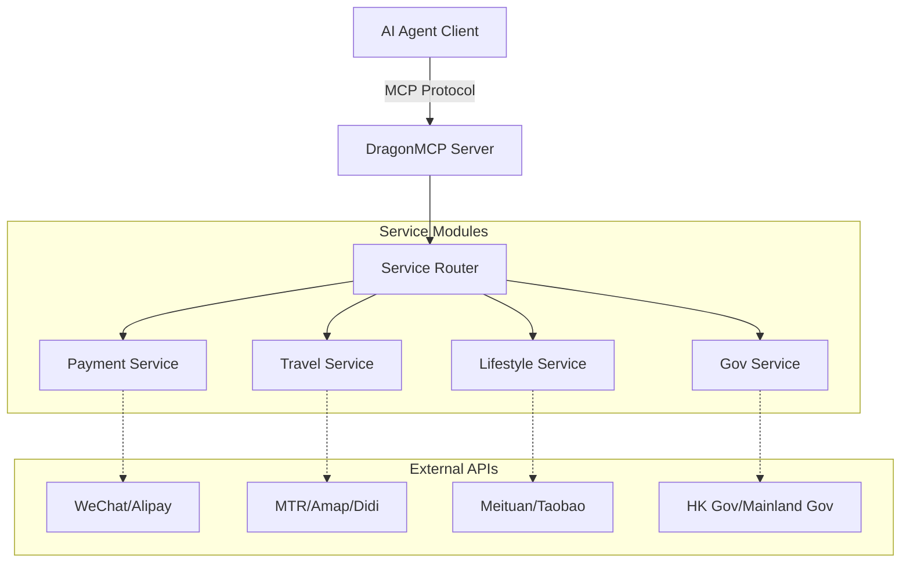

<div align="center">
  

  # DragonMCP

  **Das Nervenzentrum für Chinesische Local Life Agents**

  [English](README.md) | [简体中文](README_zh-CN.md) | [日本語](README_ja.md) | [한국어](README_ko.md) | [Français](README_fr.md) | [Deutsch](README_de.md)

  Lassen Sie Claude / DeepSeek / Qwen direkt Ihr Essen bestellen, ein DiDi rufen, Hochgeschwindigkeitszugtickets prüfen und Stromrechnungen bezahlen.

  [Produktanforderungen (PRD)](.trae/documents/dragon_mcp_prd.md) • [Architektur](.trae/documents/dragon_mcp_technical_architecture.md) • [Mitwirken](#-contributing--mitwirken)

  [](https://opensource.org/licenses/MIT)
  [](https://www.typescriptlang.org/)
  [](https://modelcontextprotocol.io/)
  [](https://nodejs.org/)
  [](https://github.com/arthurpanhku/DragonMCP/pulls)
</div>

---

## 🌟 Was ist DragonMCP?

DragonMCP ist ein Model Context Protocol (MCP) Server, der entwickelt wurde, um die Lücke zwischen KI-Agenten und lokalen Lebensdiensten in **Greater China (Festlandchina, Hongkong) und Asien** zu schließen.

Es zielt darauf ab, das "letzte Meile"-Problem zwischen KI-Agenten und realen Diensten zu lösen.

---

## 🔥 Live-Demo: MTR Echtzeit-Fahrplan

Wir haben das **MTR (Mass Transit Railway) Abfragetool** als unser erstes MVP implementiert. KI-Agenten können nun Echtzeit-Zugfahrpläne direkt von der offenen API der MTR abrufen.

**Szenario**:
> Benutzer: "Wann fährt der nächste Zug von Admiralty nach Central?"

**Agenten-Antwort**:
> "Next Island Line train from Admiralty to Central (towards Kennedy Town):
> - Arriving in: 2 min(s) (10:30:00)
> - Subsequent trains: 5 min(s) (10:33:00)"

*(Probieren Sie es selbst aus, indem Sie DragonMCP mit Ihrem MCP-Client verbinden!)*

---

## 🏗️ Architektur

DragonMCP fungiert als Middleware zwischen KI-Agenten und verschiedenen lokalen Dienst-APIs.



Weitere Details finden Sie im [Technischen Architekturdokument](.trae/documents/dragon_mcp_technical_architecture.md).

---

## 🗺️ Roadmap & Funktionen

### Phase 1: MVP (Aktuell)
- [x] **Kernframework**: Express + MCP SDK + TypeScript Setup.
- [x] **Reisen (MTR)**: Echtzeit-Fahrplanabfrage für Island Line & Tsuen Wan Line.
- [ ] **Essenslieferung (Demo)**: Simulation des Bestellprozesses (Shop-Suche -> Menü -> Warenkorb).
- [ ] **Grundkonfiguration**: Umgebungsvariablen & Projektstruktur.

### Phase 2: Erweiterung
- [ ] **Zahlungsintegration**: WeChat Pay / Alipay (Sandbox/QR-Code-Generierung).
- [ ] **Mehr Transport**: Hochgeschwindigkeitszug (12306) Ticketprüfung, DiDi/Uber Schätzung.
- [ ] **E-Commerce**: Produktsuchaggregation (Taobao/JD).
- [ ] **Multi-Regionen-Support**: Kontextwechsel zwischen Festlandchina / HK / SG.

### Phase 3: Ökosystem
- [ ] **Plugin-System**: Ermöglicht der Community, einzelne Diensttools beizutragen.
- [ ] **Benutzerauthentifizierung**: Sichere Benutzertokenverwaltung für persönliche Dienste.

---

## 🚀 Erste Schritte

### Voraussetzungen
*   Node.js >= 18
*   npm oder yarn

### Installation

1.  Repository klonen:
    ```bash
    git clone https://github.com/arthurpanhku/DragonMCP.git
    cd DragonMCP
    ```

2.  Abhängigkeiten installieren:
    ```bash
    npm install
    ```

3.  Umgebungsvariablen konfigurieren:
    ```bash
    cp .env.example .env
    # Bearbeiten Sie .env falls nötig (MTR API benötigt derzeit keinen Schlüssel)
    ```

### Server starten

Starten Sie den Entwicklungsserver mit SSE-Unterstützung:

```bash
npm run dev
```

Der Server startet unter `http://localhost:3000`.
SSE-Endpunkt: `http://localhost:3000/mcp/sse`

### Verbindung zu Claude Desktop

Fügen Sie Folgendes zu Ihrer `claude_desktop_config.json` hinzu:

```json
{
  "mcpServers": {
    "DragonMCP": {
      "command": "node",
      "args": ["/path/to/DragonMCP/dist/server.js"], 
      "env": {
        "NODE_ENV": "production"
      }
    }
  }
}
```
*(Hinweis: Für die lokale Entwicklung müssen Sie möglicherweise zuerst bauen oder auf den ts-node Wrapper verweisen)*

---

## 🧪 Testen

Führen Sie Unit- und Integrationstests aus:

```bash
# Experimentelle VM-Module für Jest aktivieren (ESM-Unterstützung)
NODE_OPTIONS="$NODE_OPTIONS --experimental-vm-modules" npm test
```

---

## 🤝 Mitwirken

Wir begrüßen alle Beiträge! Egal ob Entwickler, Designer oder Produktvordenker.

### Wir brauchen Hilfe bei:
1.  **Playwright Skripte**: Simulation von Web-Flows für Essensliefer-Apps (Meituan/Ele.me).
2.  **Mehr MTR-Linien**: Hinzufügen von Stationsdaten für East Rail Line, Tuen Ma Line, usw.
3.  **Doks**: Übersetzung der Dokumentation in andere Sprachen.

Siehe [CONTRIBUTING.md](CONTRIBUTING.md) (Demnächst) für Details.

---

## 📄 Lizenz

Dieses Projekt ist unter der MIT-Lizenz lizenziert - siehe die [LICENSE](LICENSE) Datei für Details.
