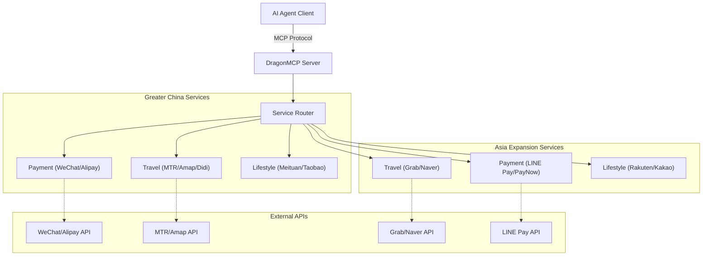

<div align="center">
  

  # DragonMCP

  **Le Centre Nerveux des Agents de Vie Locale Chinois**

  [English](README.md) | [简体中文](README_zh-CN.md) | [日本語](README_ja.md) | [한국어](README_ko.md) | [Français](README_fr.md) | [Deutsch](README_de.md)

  Laissez Claude / DeepSeek / Qwen commander directement vos plats à emporter, appeler un DiDi, vérifier les billets de train à grande vitesse et payer vos factures de services publics.

  [Exigences Produit (PRD)](.trae/documents/dragon_mcp_prd.md) • [Architecture](.trae/documents/dragon_mcp_technical_architecture.md) • [Contribuer](#-contributing--contribuer)

  [](https://opensource.org/licenses/MIT)
  [](https://www.typescriptlang.org/)
  [](https://modelcontextprotocol.io/)
  [](https://nodejs.org/)
  [](https://github.com/arthurpanhku/DragonMCP/pulls)
</div>

---

## 🌟 Qu'est-ce que DragonMCP ?

DragonMCP est un serveur Model Context Protocol (MCP) conçu pour combler le fossé entre les agents IA et les services de vie locale en **Grande Chine (Chine continentale, Hong Kong) et en Asie**.

Il vise à résoudre le problème du "dernier kilomètre" entre les agents IA et les services du monde réel.

---

## 🔥 Démo en Direct : Horaires MTR en Temps Réel

Nous avons implémenté l'**Outil de Requête MTR (Mass Transit Railway)** comme notre premier MVP. Les agents IA peuvent désormais récupérer les horaires de train en temps réel directement depuis l'API ouverte de MTR.

**Scénario**:
> Utilisateur : "Quand est le prochain train d'Admiralty à Central ?"

**Réponse de l'Agent**:
> "Next Island Line train from Admiralty to Central (towards Kennedy Town):
> - Arriving in: 2 min(s) (10:30:00)
> - Subsequent trains: 5 min(s) (10:33:00)"

*(Essayez-le vous-même en connectant DragonMCP à votre client MCP !)*

---

## 🛠️ Services Supportés (Bêta)

Nous étendons activement notre support pour les services locaux. Voici les interfaces actuellement intégrées (certaines sont des mocks/placeholders pour le développement) :

| Région             | Catégorie     | Service              | Nom de l'outil           | Description                                              | Statut |
| :----------------- | :------------ | :------------------- | :----------------------- | :------------------------------------------------------- | :----- |
| **Grande Chine**   | **Voyage**    | **MTR (HK)**         | `search_mtr_schedule`    | Horaires de train en temps réel (Ligne Island/Tsuen Wan) | ✅ Live |
|                    |               | **Amap (Gaode)**     | `amap_search_poi`        | Recherche de POI (Restaurants, Hôtels, etc.)             | ✅ Live |
|                    |               | **Amap (Gaode)**     | `amap_walking_direction` | Planification d'itinéraire à pied                        | ✅ Live |
|                    |               | **DiDi**             | `book_taxi_didi`         | Estimation du prix et réservation de course              | 🚧 Mock |
|                    | **Paiement**  | **WeChat Pay**       | `wechat_pay_create`      | Créer une commande de paiement                           | 🚧 Mock |
|                    |               | **Alipay**           | `alipay_pay_create`      | Créer une commande de paiement                           | 🚧 Mock |
|                    | **Lifestyle** | **Meituan**          | `meituan_search_food`    | Recherche de livraison de nourriture                     | 🚧 Mock |
|                    | **Shopping**  | **Taobao**           | `taobao_search_product`  | Recherche de produits                                    | 🚧 Mock |
| **Extension Asie** | **Voyage**    | **Grab (SG/SEA)**    | `book_ride_grab`         | Estimation et réservation de course                      | 🚧 Mock |
|                    |               | **Naver Maps (KR)**  | `naver_map_search`       | Recherche de lieux en Corée                              | 🚧 Mock |
|                    | **Paiement**  | **LINE Pay (JP/TW)** | `line_pay_request`       | Demander un paiement                                     | 🚧 Mock |

---

## ⚠️ Sécurité & Avertissement

> **IMPORTANT**: Ce projet inclut des implémentations Mock pour des services sensibles comme les paiements (WeChat Pay, Alipay) et les VTC (DiDi).

*   **NE PAS** utiliser de données financières réelles ou d'identifiants personnels dans la version actuelle.
*   Les outils de paiement (`wechat_pay_create`, `alipay_pay_create`) renvoient actuellement des **données factices** uniquement à des fins de démonstration. Aucun transfert d'argent réel n'est effectué.
*   Lors de l'intégration d'API réelles à l'avenir, assurez-vous de suivre des protocoles de sécurité stricts (OAuth, HTTPS, Gestion des Tokens).

---

## 🏗️ Architecture

DragonMCP agit comme un middleware entre les agents IA et diverses API de services locaux.



Pour plus de détails, veuillez vous référer au [Document d'Architecture Technique](.trae/documents/dragon_mcp_technical_architecture.md).

---

## 🗺️ Feuille de Route et Fonctionnalités

### Phase 1 : MVP (Actuel)
- [x] **Framework Principal**: Configuration Express + MCP SDK + TypeScript.
- [x] **Voyage (MTR)**: Requête d'horaires en temps réel pour Island Line & Tsuen Wan Line.
- [x] **Voyage (Amap)**: Recherche de POI et itinéraires à pied.
- [x] **Mocks de Service**: Structure de base pour WeChat/Alipay/DiDi/Meituan/Taobao.
- [ ] **Livraison de Nourriture (Démo)**: Simuler le processus de commande (Recherche Boutique -> Menu -> Panier).
- [ ] **Configuration de Base**: Variables d'environnement & structure du projet.

### Phase 2 : Extension Asie (Nouveau !)
- [x] **Mise en Place Structure**: Répertoires de service pour Singapour (Grab), Japon (LINE), Corée (Naver).
- [x] **Mocks Initiaux**: Réservation Grab, demande LINE Pay, recherche Naver Map.
- [ ] **Intégration API Réelle**: Remplacer les mocks par de vraies API (Grab Developer, LINE Pay API).
- [ ] **Plus de Services**: Kakao Pay (KR), Yahoo! Transit (JP), EZ-Link (SG).

### Phase 3 : Écosystème
- [ ] **Système de Plugins**: Permettre à la communauté de contribuer des outils de service individuels.
- [ ] **Authentification Utilisateur**: Gestion sécurisée des jetons utilisateur pour les services personnels.

---

## 🚀 Commencer

### Prérequis
*   Node.js >= 18
*   npm ou yarn

### Installation

1.  Cloner le dépôt :
    ```bash
    git clone https://github.com/arthurpanhku/DragonMCP.git
    cd DragonMCP
    ```

2.  Installer les dépendances :
    ```bash
    npm install
    ```

3.  Configurer les variables d'environnement :
    ```bash
    cp .env.example .env
    # Éditer .env (AMAP_API_KEY requis pour les services de cartographie)
    ```

### Lancer le Serveur

Démarrer le serveur de développement avec support SSE :

```bash
npm run dev
```

Le serveur démarrera à `http://localhost:3000`.
Point de terminaison SSE : `http://localhost:3000/mcp/sse`

### Se Connecter à Claude Desktop

Ajoutez ce qui suit à votre `claude_desktop_config.json` :

```json
{
  "mcpServers": {
    "DragonMCP": {
      "command": "node",
      "args": ["/path/to/DragonMCP/dist/server.js"], 
      "env": {
        "NODE_ENV": "production"
      }
    }
  }
}
```
*(Note : Pour le développement local, vous devrez peut-être construire d'abord ou pointer vers le wrapper ts-node)*

---

## ❓ FAQ & Dépannage

### Q : Pourquoi est-ce que j'obtiens "Station not found" pour la requête MTR ?
R : Actuellement, seules les **Island Line** et **Tsuen Wan Line** sont supportées. Veuillez vérifier si le nom de la station est correctement orthographié (par exemple, "Admiralty", "Central", "Mong Kok").

### Q : Comment obtenir une clé API Amap (Gaode) ?
R : Vous devez vous inscrire sur la [Plateforme Ouverte Amap](https://lbs.amap.com/), créer une application "Web Service", et copier la clé dans votre fichier `.env` sous `AMAP_API_KEY`.

### Q : Puis-je utiliser ceci pour de vrais paiements ?
R : **Non.** Les outils de paiement actuels sont des mocks. Ne les utilisez pas pour des transactions réelles.

---

## 🧪 Tests

Exécuter les tests unitaires et d'intégration :

```bash
# Activer les modules VM expérimentaux pour Jest (support ESM)
NODE_OPTIONS="$NODE_OPTIONS --experimental-vm-modules" npm test
```

---

## 🤝 Contribuer

Nous accueillons toutes les contributions ! Que vous soyez développeur, designer ou penseur produit.

### Nous avons besoin d'aide avec :
1.  **Scripts Playwright**: Simuler les flux web des applications de livraison de nourriture (Meituan/Ele.me).
2.  **Plus de Lignes MTR**: Ajouter des données de station pour East Rail Line, Tuen Ma Line, etc.
3.  **Intégration API Réelle**: Remplacer les mocks par de vraies API pour WeChat/Alipay/DiDi.

Voir [CONTRIBUTING.md](CONTRIBUTING.md) (Bientôt disponible) pour plus de détails.

---

## 🙏 Remerciements

*   **Anthropic**: Pour avoir créé le Model Context Protocol (MCP).
*   **MTR Corporation**: Pour avoir fourni l'API de données ouvertes.
*   **Amap (Gaode)**: Pour les services de cartographie et de POI.

---

## 📄 Licence

Ce projet est sous licence MIT - voir le fichier [LICENSE](LICENSE) pour plus de détails.
