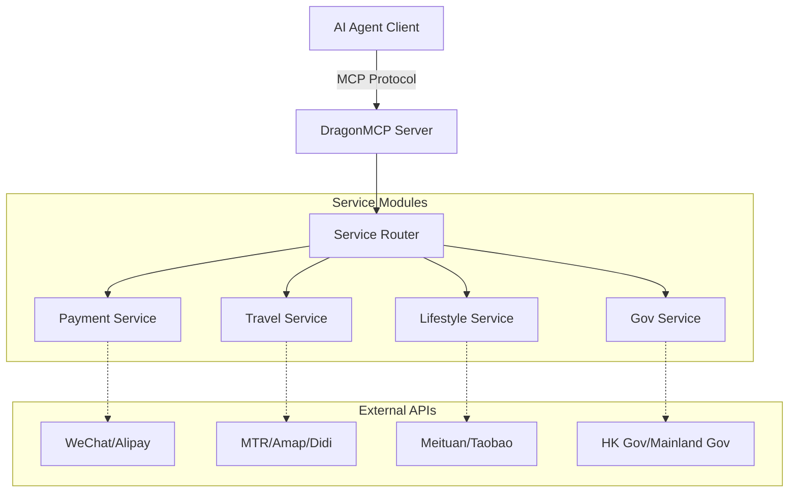

<div align="center">
  

  # DragonMCP

  **中国ローカルライフエージェントの神経中枢**

  [English](README.md) | [简体中文](README_zh-CN.md) | [日本語](README_ja.md) | [한국어](README_ko.md) | [Français](README_fr.md) | [Deutsch](README_de.md)

  Claude / DeepSeek / Qwen に、デリバリーの注文、DiDiの配車、高速鉄道チケットの確認、公共料金の支払いを直接任せましょう。

  [製品要件 (PRD)](.trae/documents/dragon_mcp_prd.md) • [アーキテクチャ](.trae/documents/dragon_mcp_technical_architecture.md) • [貢献](#-contributing--貢献)

  [](https://opensource.org/licenses/MIT)
  [](https://www.typescriptlang.org/)
  [](https://modelcontextprotocol.io/)
  [](https://nodejs.org/)
  [](https://github.com/arthurpanhku/DragonMCP/pulls)
</div>

---

## 🌟 DragonMCPとは？

DragonMCPは、AIエージェントと**大中華圏（中国本土、香港）およびアジア**のローカルライフサービスとの架け橋となるように設計されたModel Context Protocol (MCP) サーバーです。

AIエージェントと現実世界のサービス間の「ラストワンマイル」の問題を解決することを目指しています。

---

## 🔥 ライブデモ：MTRリアルタイム時刻表

最初のMVP（実用最小限の製品）として、**MTR（香港鉄路）クエリツール**を実装しました。AIエージェントは、MTRのオープンAPIからリアルタイムの列車時刻表を直接取得できるようになりました。

**シナリオ**:
> ユーザー：「金鐘（Admiralty）から中環（Central）への次の列車はいつですか？」

**エージェントの応答**:
> "Next Island Line train from Admiralty to Central (towards Kennedy Town):
> - Arriving in: 2 min(s) (10:30:00)
> - Subsequent trains: 5 min(s) (10:33:00)"

*(DragonMCPをMCPクライアントに接続して、ぜひ試してみてください！)*

---

## 🛠️ サポートされているサービス (ベータ版)

ローカルサービスのサポートを積極的に拡大しています。以下は現在統合されているインターフェースです（一部は開発用のモック/プレースホルダーです）：

| カテゴリ           | サービス           | ツール名                 | 説明                                   | ステータス |
| :----------------- | :----------------- | :----------------------- | :------------------------------------- | :--------- |
| **交通**           | **MTR (香港)**     | `search_mtr_schedule`    | リアルタイム列車時刻表 (港島線/荃湾線) | ✅ 稼働中   |
|                    | **Amap (高徳)**    | `amap_search_poi`        | POI検索 (レストラン、ホテルなど)       | ✅ 稼働中   |
|                    | **Amap (高徳)**    | `amap_walking_direction` | 徒歩ルート検索                         | ✅ 稼働中   |
|                    | **DiDi**           | `book_taxi_didi`         | 価格見積もりと配車予約                 | 🚧 モック   |
| **決済**           | **WeChat Pay**     | `wechat_pay_create`      | 支払い注文の作成                       | 🚧 モック   |
|                    | **Alipay**         | `alipay_pay_create`      | 支払い注文の作成                       | 🚧 モック   |
| **ライフスタイル** | **美団 (Meituan)** | `meituan_search_food`    | フードデリバリー検索                   | 🚧 モック   |
| **ショッピング**   | **淘宝 (Taobao)**  | `taobao_search_product`  | 商品検索                               | 🚧 モック   |

---

## ⚠️ セキュリティと免責事項

> **重要**: このプロジェクトには、決済（WeChat Pay、Alipay）や配車（DiDi）などの機密サービスのモック実装が含まれています。

*   **絶対に** 現在のバージョンで実際の財務データや個人情報を使用しないでください。
*   決済ツール (`wechat_pay_create`, `alipay_pay_create`) は現在、デモンストレーション目的でのみ **偽のデータ** を返します。実際のお金の移動は発生しません。
*   将来的に実際のAPIを統合する場合は、厳格なセキュリティプロトコル（OAuth、HTTPS、トークン管理）に従ってください。

---

## 🏗️ アーキテクチャ

DragonMCPは、AIエージェントとさまざまなローカルサービスAPI間のミドルウェアとして機能します。



詳細については、[技術アーキテクチャドキュメント](.trae/documents/dragon_mcp_technical_architecture.md)を参照してください。

---

## 🗺️ ロードマップと機能

### フェーズ1：MVP（現在）
- [x] **コアフレームワーク**: Express + MCP SDK + TypeScriptのセットアップ。
- [x] **交通 (MTR)**: 港島線と荃湾線のリアルタイム時刻表クエリ。
- [x] **交通 (Amap)**: POI検索と徒歩ルート案内。
- [x] **サービスモック**: WeChat/Alipay/DiDi/Meituan/Taobaoの基本構造。
- [ ] **フードデリバリー (Demo)**: 注文プロセスのシミュレーション（店舗検索 -> メニュー選択 -> カート追加）。
- [ ] **基本設定**: 環境変数とプロジェクト構造。

### フェーズ2：拡張
- [ ] **決済統合**: WeChat Pay / Alipay（サンドボックス/QRコード生成）。
- [ ] **交通機関の追加**: 高速鉄道（12306）のチケット確認、DiDi/Uberの見積もり。
- [ ] **Eコマース**: 商品検索の集約（Taobao/JD）。
- [ ] **多地域サポート**: 中国本土 / 香港 / シンガポール間のコンテキスト切り替え。

### フェーズ3：エコシステム
- [ ] **プラグインシステム**: コミュニティが個別のサービスツールを提供できるようにする。
- [ ] **ユーザー認証**: 個人サービスのための安全なトークン管理。

---

## 🚀 はじめに

### 前提条件
*   Node.js >= 18
*   npm または yarn

### インストール

1.  リポジトリをクローンします:
    ```bash
    git clone https://github.com/arthurpanhku/DragonMCP.git
    cd DragonMCP
    ```

2.  依存関係をインストールします:
    ```bash
    npm install
    ```

3.  環境変数を設定します:
    ```bash
    cp .env.example .env
    # 必要に応じて .env を編集します（地図サービスには AMAP_API_KEY が必要です）
    ```

### サーバーの実行

SSEサポート付きで開発サーバーを起動します:

```bash
npm run dev
```

サーバーは `http://localhost:3000` で起動します。
SSEエンドポイント: `http://localhost:3000/mcp/sse`

### Claude Desktopへの接続

`claude_desktop_config.json` に以下を追加してください:

```json
{
  "mcpServers": {
    "DragonMCP": {
      "command": "node",
      "args": ["/path/to/DragonMCP/dist/server.js"], 
      "env": {
        "NODE_ENV": "production"
      }
    }
  }
}
```
*(注：ローカル開発の場合は、最初にビルドするか、ts-nodeラッパーを指定する必要がある場合があります)*

---

## ❓ FAQ & トラブルシューティング

### Q: MTRクエリで「Station not found」と表示されるのはなぜですか？
A: 現在、**港島線**と**荃湾線**のみサポートされています。駅名のスペルが正しいか確認してください（例："Admiralty", "Central", "Mong Kok"）。

### Q: Amap (高徳) APIキーはどうやって取得しますか？
A: [Amapオープンロープラットフォーム](https://lbs.amap.com/)に登録し、「Webサービス」アプリケーションを作成して、キーを`.env`ファイルの`AMAP_API_KEY`にコピーする必要があります。

### Q: これを実際の支払いに使用できますか？
A: **いいえ。** 現在の決済ツールはモックです。実際の取引には使用しないでください。

---

## 🧪 テスト

単体テストと統合テストを実行します:

```bash
# Jestの実験的VMモジュールを有効にする（ESMサポート）
NODE_OPTIONS="$NODE_OPTIONS --experimental-vm-modules" npm test
```

---

## 🤝 貢献

開発者、デザイナー、プロダクト思想家を問わず、あらゆる貢献を歓迎します！

### 以下の支援を必要としています：
1.  **Playwrightスクリプト**: フードデリバリーアプリ（美団/Ele.me）のWebフローのシミュレーション。
2.  **MTR路線の追加**: 東鉄線、屯馬線などの駅データの追加。
3.  **リアルAPI統合**: WeChat/Alipay/DiDiのモックをリアルAPIに置き換える。

詳細は [CONTRIBUTING.md](CONTRIBUTING.md)（近日公開）を参照してください。

---

## 🙏 謝辞

*   **Anthropic**: Model Context Protocol (MCP) の作成に対して。
*   **MTR Corporation**: オープンデータAPIの提供に対して。
*   **Amap (高徳)**: 地図およびPOIサービスの提供に対して。

---

## 📄 ライセンス

このプロジェクトはMITライセンスの下でライセンスされています - 詳細は [LICENSE](LICENSE) ファイルを参照してください。
