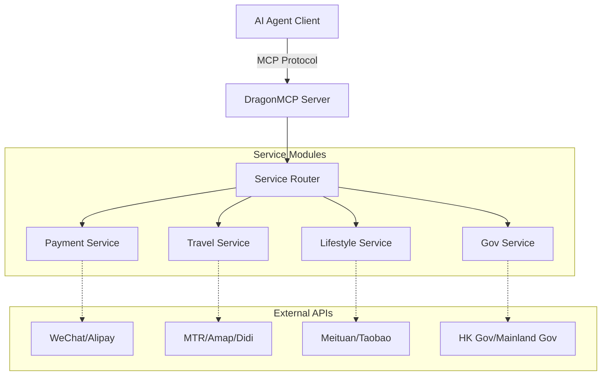

<div align="center">
  

  # DragonMCP

  **중국 로컬 라이프 에이전트의 신경 중추**

  [English](README.md) | [简体中文](README_zh-CN.md) | [日本語](README_ja.md) | [한국어](README_ko.md) | [Français](README_fr.md) | [Deutsch](README_de.md)

  Claude / DeepSeek / Qwen이 배달 주문, DiDi 호출, 고속철도 표 확인, 공과금 납부를 직접 수행하게 하세요.

  [제품 요구사항 (PRD)](.trae/documents/dragon_mcp_prd.md) • [아키텍처](.trae/documents/dragon_mcp_technical_architecture.md) • [기여하기](#-contributing--기여하기)

  [](https://opensource.org/licenses/MIT)
  [](https://www.typescriptlang.org/)
  [](https://modelcontextprotocol.io/)
  [](https://nodejs.org/)
  [](https://github.com/arthurpanhku/DragonMCP/pulls)
</div>

---

## 🌟 DragonMCP란?

DragonMCP는 AI 에이전트와 **중화권(중국 본토, 홍콩) 및 아시아**의 현지 생활 서비스 간의 격차를 해소하기 위해 설계된 MCP(Model Context Protocol) 서버입니다.

AI 에이전트와 실제 서비스 간의 "라스트 마일" 문제를 해결하는 것을 목표로 합니다.

---

## 🔥 라이브 데모: MTR 실시간 시간표

첫 번째 MVP(최소 기능 제품)로 **MTR(홍콩 철도) 조회 도구**를 구현했습니다. 이제 AI 에이전트가 MTR의 오픈 API에서 실시간 열차 시간표를 직접 가져올 수 있습니다.

**시나리오**:
> 사용자: "Admiralty(애드미럴티)에서 Central(센트럴)로 가는 다음 열차는 언제인가요?"

**에이전트 응답**:
> "Next Island Line train from Admiralty to Central (towards Kennedy Town):
> - Arriving in: 2 min(s) (10:30:00)
> - Subsequent trains: 5 min(s) (10:33:00)"

*(DragonMCP를 MCP 클라이언트에 연결하여 직접 체험해 보세요!)*

---

## 🛠️ 지원되는 서비스 (베타)

현지 서비스 지원을 적극적으로 확장하고 있습니다. 다음은 현재 통합된 인터페이스입니다 (일부는 개발용 모의/자리 표시자입니다):

| 카테고리         | 서비스          | 도구 이름                | 설명                                       | 상태     |
| :--------------- | :-------------- | :----------------------- | :----------------------------------------- | :------- |
| **여행**         | **MTR (홍콩)**  | `search_mtr_schedule`    | 실시간 열차 시간표 (Island/Tsuen Wan Line) | ✅ 라이브 |
|                  | **Amap (고덕)** | `amap_search_poi`        | POI 검색 (레스토랑, 호텔 등)               | ✅ 라이브 |
|                  | **Amap (고덕)** | `amap_walking_direction` | 도보 경로 계획                             | ✅ 라이브 |
|                  | **DiDi**        | `book_taxi_didi`         | 가격 견적 및 승차 예약                     | 🚧 모의   |
| **결제**         | **WeChat Pay**  | `wechat_pay_create`      | 결제 주문 생성                             | 🚧 모의   |
|                  | **Alipay**      | `alipay_pay_create`      | 결제 주문 생성                             | 🚧 모의   |
| **라이프스타일** | **Meituan**     | `meituan_search_food`    | 음식 배달 검색                             | 🚧 모의   |
| **쇼핑**         | **Taobao**      | `taobao_search_product`  | 상품 검색                                  | 🚧 모의   |

---

## ⚠️ 보안 및 면책 조항

> **중요**: 이 프로젝트에는 결제(WeChat Pay, Alipay) 및 승차 호출(DiDi)과 같은 민감한 서비스에 대한 모의 구현이 포함되어 있습니다.

*   **절대** 현재 버전에서 실제 금융 데이터나 개인 자격 증명을 사용하지 마십시오.
*   결제 도구(`wechat_pay_create`, `alipay_pay_create`)는 현재 데모 목적으로 **가짜 데이터**만 반환합니다. 실제 송금은 이루어지지 않습니다.
*   향후 실제 API를 통합할 때는 엄격한 보안 프로토콜(OAuth, HTTPS, 토큰 관리)을 준수해야 합니다.

---

## 🏗️ 아키텍처

DragonMCP는 AI 에이전트와 다양한 로컬 서비스 API 간의 미들웨어 역할을 합니다.



자세한 내용은 [기술 아키텍처 문서](.trae/documents/dragon_mcp_technical_architecture.md)를 참조하세요.

---

## 🗺️ 로드맵 및 기능

### 1단계: MVP (현재)
- [x] **핵심 프레임워크**: Express + MCP SDK + TypeScript 설정.
- [x] **여행 (MTR)**: 아일랜드선 및 Tsuen Wan선 실시간 시간표 조회.
- [x] **여행 (Amap)**: POI 검색 및 도보 경로 안내.
- [x] **서비스 모의**: WeChat/Alipay/DiDi/Meituan/Taobao 기본 구조.
- [ ] **음식 배달 (데모)**: 주문 프로세스 시뮬레이션 (상점 검색 -> 메뉴 선택 -> 장바구니).
- [ ] **기본 구성**: 환경 변수 및 프로젝트 구조.

### 2단계: 확장
- [ ] **결제 통합**: WeChat Pay / Alipay (샌드박스/QR 코드 생성).
- [ ] **교통편 추가**: 고속철도(12306) 표 확인, DiDi/Uber 견적.
- [ ] **전자상거래**: 상품 검색 통합 (Taobao/JD).
- [ ] **다중 지역 지원**: 중국 본토 / 홍콩 / 싱가포르 간 컨텍스트 전환.

### 3단계: 생태계
- [ ] **플러그인 시스템**: 커뮤니티가 개별 서비스 도구를 기여할 수 있도록 허용.
- [ ] **사용자 인증**: 개인 서비스를 위한 안전한 토큰 관리.

---

## 🚀 시작하기

### 필수 조건
*   Node.js >= 18
*   npm 또는 yarn

### 설치

1.  저장소 복제:
    ```bash
    git clone https://github.com/arthurpanhku/DragonMCP.git
    cd DragonMCP
    ```

2.  종속성 설치:
    ```bash
    npm install
    ```

3.  환경 변수 구성:
    ```bash
    cp .env.example .env
    # 필요한 경우 .env 편집 (지도 서비스에는 AMAP_API_KEY 필요)
    ```

### 서버 실행

SSE 지원으로 개발 서버 시작:

```bash
npm run dev
```

서버는 `http://localhost:3000`에서 시작됩니다.
SSE 엔드포인트: `http://localhost:3000/mcp/sse`

### Claude Desktop에 연결

`claude_desktop_config.json`에 다음을 추가하세요:

```json
{
  "mcpServers": {
    "DragonMCP": {
      "command": "node",
      "args": ["/path/to/DragonMCP/dist/server.js"], 
      "env": {
        "NODE_ENV": "production"
      }
    }
  }
}
```
*(참고: 로컬 개발의 경우 먼저 빌드하거나 ts-node 래퍼를 가리켜야 할 수 있습니다)*

---

## ❓ FAQ 및 문제 해결

### Q: MTR 조회 시 "Station not found"가 표시되는 이유는 무엇인가요?
A: 현재 **Island Line** 및 **Tsuen Wan Line**만 지원됩니다. 역 이름의 철자가 올바른지 확인하십시오(예: "Admiralty", "Central", "Mong Kok").

### Q: Amap(고덕) API 키는 어떻게 얻나요?
A: [Amap 오픈 플랫폼](https://lbs.amap.com/)에 등록하고 "Web Service" 애플리케이션을 만든 다음 키를 `.env` 파일에 `AMAP_API_KEY`로 복사해야 합니다.

### Q: 실제 결제에 사용할 수 있나요?
A: **아니요.** 현재 결제 도구는 모의입니다. 실제 거래에 사용하지 마십시오.

---

## 🧪 테스트

단위 및 통합 테스트 실행:

```bash
# Jest용 실험적 VM 모듈 활성화 (ESM 지원)
NODE_OPTIONS="$NODE_OPTIONS --experimental-vm-modules" npm test
```

---

## 🤝 기여하기

개발자, 디자이너, 제품 기획자 등 모든 분들의 기여를 환영합니다!

### 도움이 필요한 부분:
1.  **Playwright 스크립트**: 음식 배달 앱(Meituan/Ele.me) 웹 흐름 시뮬레이션.
2.  **추가 MTR 노선**: East Rail Line, Tuen Ma Line 등의 역 데이터 추가.
3.  **실제 API 통합**: WeChat/Alipay/DiDi의 모의 구현을 실제 API로 대체.

자세한 내용은 [CONTRIBUTING.md](CONTRIBUTING.md) (곧 공개 예정)를 참조하세요.

---

## 🙏 감사의 말

*   **Anthropic**: MCP(Model Context Protocol) 생성.
*   **MTR Corporation**: 오픈 데이터 API 제공.
*   **Amap (Gaode)**: 지도 및 POI 서비스 제공.

---

## 📄 라이선스

이 프로젝트는 MIT 라이선스에 따라 라이선스가 부여됩니다. 자세한 내용은 [LICENSE](LICENSE) 파일을 참조하세요.
