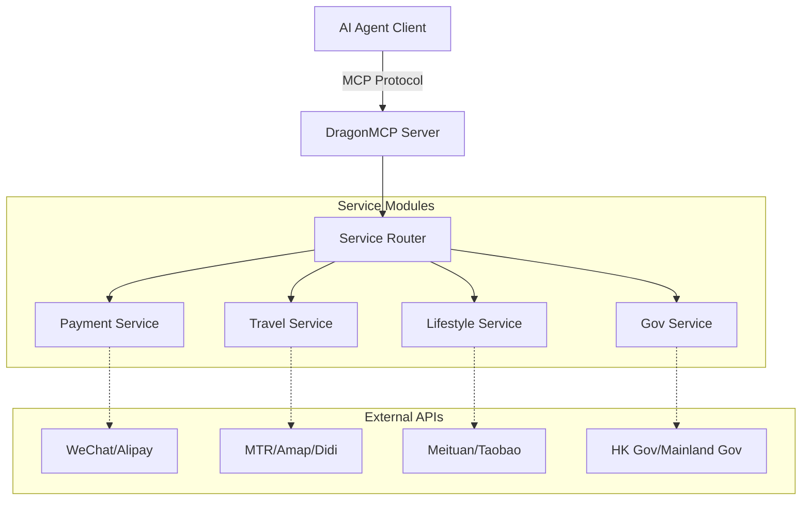

<div align="center">
  

  # DragonMCP

  **中文生活 Agent 的神经中枢**

  [English](README.md) | [简体中文](README_zh-CN.md) | [日本語](README_ja.md) | [한국어](README_ko.md) | [Français](README_fr.md) | [Deutsch](README_de.md)

  让 Claude / DeepSeek / Qwen 直接帮你点外卖、叫滴滴、查高铁余票、缴水电费。

  [产品需求文档 (PRD)](.trae/documents/dragon_mcp_prd.md) • [技术架构](.trae/documents/dragon_mcp_technical_architecture.md) • [贡献指南](#-contributing--贡献指南)

  [](https://opensource.org/licenses/MIT)
  [](https://www.typescriptlang.org/)
  [](https://modelcontextprotocol.io/)
  [](https://nodejs.org/)
  [](https://github.com/arthurpanhku/DragonMCP/pulls)
</div>

---

## 🌟 项目简介

DragonMCP 是一个专为 AI Agent 设计的 Model Context Protocol (MCP) 服务器，旨在打通 AI Agent 与**大中华区（中国内地、香港）及亚洲地区**本地生活服务之间的最后一公里。

---

## 🔥 实战演示：港铁实时班次

作为第一个 MVP（最小可行性产品），我们已经实现了**港铁（MTR）实时查询工具**。AI Agent 现在可以直接调用港铁开放 API 获取实时列车班次。

**场景**:
> 用户：“从金钟到中环的下一班车还有多久？”

**Agent 回复**:
> "Next Island Line train from Admiralty to Central (towards Kennedy Town):
> - Arriving in: 2 min(s) (10:30:00)
> - Subsequent trains: 5 min(s) (10:33:00)"

*(快连接 DragonMCP 亲自试一试吧！)*

---

## 🏗️ 架构设计

DragonMCP 作为 AI Agent 与各类本地服务 API 之间的中间件。



更多详情请参阅 [技术架构文档](.trae/documents/dragon_mcp_technical_architecture.md)。

---

## 🗺️ 路线图与功能

### 第一阶段：MVP（进行中）
- [x] **核心框架**: Express + MCP SDK + TypeScript 配置。
- [x] **出行 (MTR)**: 港岛线与荃湾线实时班次查询。
- [ ] **外卖 (Demo)**: 模拟点单流程（搜店 -> 选品 -> 购物车）。
- [ ] **基础配置**: 环境变量与项目结构。

### 第二阶段：拓展
- [ ] **支付集成**: 微信支付 / 支付宝（沙箱/二维码生成）。
- [ ] **更多出行**: 高铁 (12306) 余票查询、滴滴/Uber 估价。
- [ ] **电商**: 商品搜索聚合（淘宝/京东）。
- [ ] **多地区支持**: 上下文切换（内地 / 香港 / 新加坡）。

### 第三阶段：生态
- [ ] **插件系统**: 允许社区贡献独立服务工具。
- [ ] **用户鉴权**: 个人服务的安全令牌管理。

---

## 🚀 快速开始

### 前置要求
*   Node.js >= 18
*   npm 或 yarn

### 安装

1.  克隆仓库:
    ```bash
    git clone https://github.com/arthurpanhku/DragonMCP.git
    cd DragonMCP
    ```

2.  安装依赖:
    ```bash
    npm install
    ```

3.  配置环境变量:
    ```bash
    cp .env.example .env
    # 编辑 .env 文件（目前 MTR API 无需密钥）
    ```

### 运行服务器

启动支持 SSE 的开发服务器:

```bash
npm run server:dev
```

服务器将在 `http://localhost:3000` 启动。
SSE 端点: `http://localhost:3000/mcp/sse`

### 连接到 Claude Desktop

在您的 `claude_desktop_config.json` 中添加以下内容：

```json
{
  "mcpServers": {
    "DragonMCP": {
      "command": "node",
      "args": ["/path/to/DragonMCP/api/dist/index.js"], 
      "env": {
        "NODE_ENV": "production"
      }
    }
  }
}
```
*(注意：本地开发可能需要先构建或指向 ts-node 包装器)*

---

## 🧪 测试

运行单元测试和集成测试:

```bash
# 开启 Jest 的实验性 VM 模块支持以兼容 ESM
NODE_OPTIONS="$NODE_OPTIONS --experimental-vm-modules" npm test
```

---

## 🤝 贡献指南

我们热烈欢迎所有贡献！无论你是开发者、设计师还是产品思考者。

### 我们急需：
1.  **Playwright 脚本**: 模拟外卖平台（美团/饿了么）网页流程。
2.  **更多地铁线路**: 补充东铁线、屯马线等站点数据。
3.  **文档**: 翻译文档。

详情请参阅 [CONTRIBUTING.md](CONTRIBUTING.md)（即将推出）。

---

## 📄 许可证

本项目采用 MIT 许可证 - 详情请参阅 [LICENSE](LICENSE) 文件。
