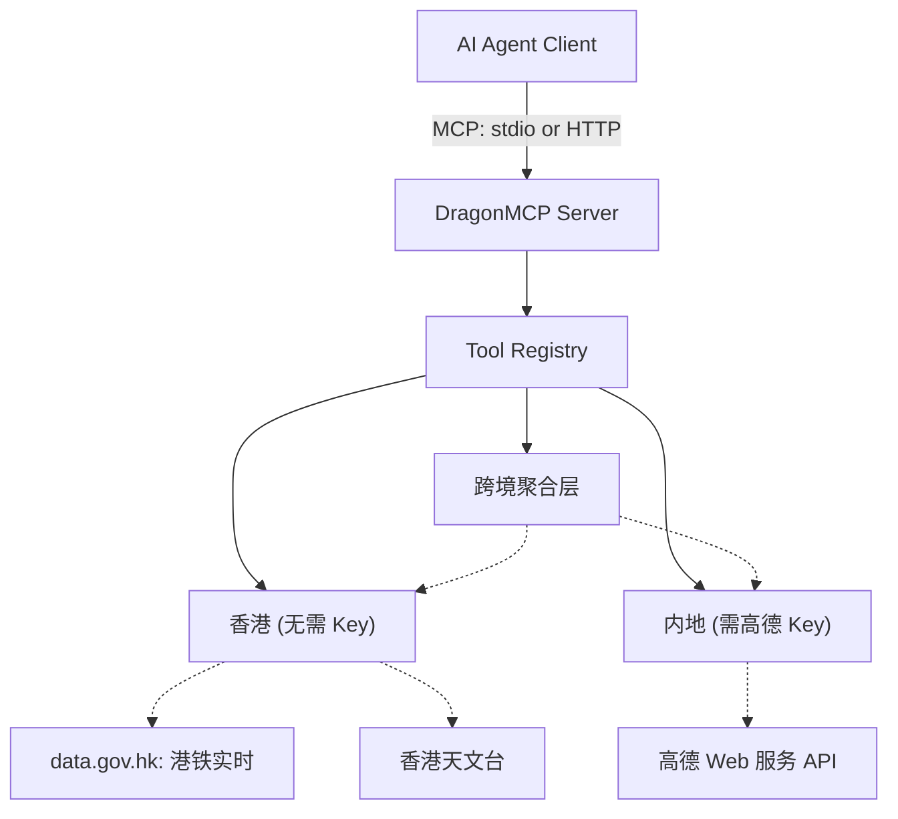

<div align="center">
  

  # DragonMCP

  **面向 AI Agent 的香港与跨境开放数据服务**

  [English](README.md) | [简体中文](README_zh-CN.md)

  港铁实时到站、香港天文台天气、内地路径规划 —— 通过 Model Context Protocol 提供。

  [快速开始](#-快速开始) • [工具列表](#️-工具列表) • [已知限制](#️-已知限制) • [路线图](#️-路线图)

  [](https://opensource.org/licenses/MIT)
  [](https://www.typescriptlang.org/)
  [](https://modelcontextprotocol.io/)
  [](https://nodejs.org/)
</div>

---

## 🌟 这是什么？

一个 MCP 服务器，为 AI Agent 提供香港及内地—香港边境地区**真实、可验证的公共数据**。

**本项目所有工具都调用真实 API，没有任何 mock。** 上游不可用时，工具会明确报错，而不会编造一个看起来合理的答案。你可以随时用内置的 `system_run_selftest` 工具自行验证——它会实时探测每一个上游数据源，并报告哪些真正可达。

为什么选这个切口：香港的公共数据是真开放的（`data.gov.hk`，无需密钥、无需申请流程），但散落在各个部门、格式互不统一。而跨境行程——一趟行程同时涉及港铁、内地铁路网和两地不同的气象机构——恰恰是任何单一机构都没有动力去服务的场景。

---

## 🔥 实时示例

**港铁实时到站** —— 无需 API Key：

```
> 金钟到中环下一班车什么时候？

Next Island Line train from Admiralty to Central (towards Kennedy Town):
- Arriving in: 0 min(s) (14:02:27)
Subsequent trains:
- 4 min(s) (14:06:27)
- 7 min(s) (14:09:27)
```

**香港天文台** —— 无需 API Key，包含生效中的警告：

```
> 香港现在天气怎么样？

Current Weather in Hong Kong (Updated: 2026-08-04T13:02:00+08:00):
- Temperature: 30°C
- Humidity: 75%
- UV Index: 8 (very high)

Warnings:
The Thunderstorm Warning has been issued. It will remain effective until
3:00 p.m. today. Isolated thunderstorms are expected to occur over New
Territories West.
```

---

## 🛠️ 工具列表

| 工具 | 数据源 | 需要 Key | 说明 |
| :--- | :--- | :--- | :--- |
| `search_mtr_schedule` | 港铁 via data.gov.hk | 否 | **含换乘的行程规划** + 实时到站；全部 10 条线、98 个站 |
| `hk_weather_current` | 香港天文台 | 否 | 当前天气 + 生效中的警告 |
| `search_transit_route` | 港铁 / 高德 | 仅内地需要 | 港/内地统一路径查询，自动选择数据源 |
| `system_run_selftest` | 以上全部 | 否 | 实时探测所有上游可达性 |
| `amap_search_poi` | 高德地图 | ✅ | 内地 POI 搜索 |
| `amap_walking_direction` | 高德地图 | ✅ | 步行路径 |
| `amap_driving_direction` | 高德地图 | ✅ | 驾车路径 |
| `amap_transit_direction` | 高德地图 | ✅ | 公共交通路径 |
| `amap_bicycling_direction` | 高德地图 | ✅ | 骑行路径 |

**港铁覆盖** —— 全部 10 条线，站名支持中英文输入：

港岛线 · 荃湾线 · 观塘线 · 将军澳线 · **东铁线（可达罗湖、落马洲口岸）** · 屯马线 · 南港岛线 · 东涌线 · 机场快线 · 迪士尼线

---

## ⚠️ 已知限制

主动写在前面，因为**隐藏限制的工具就是在对 Agent 撒谎**：

- **路线优化的是换乘次数，不是时间。** 港铁没有公开站间行车时间，所以我们只优化能实际测量的量。偶尔会出现两次换乘比返回的一次换乘更快的情况。
- **实时到站只覆盖上车段。** 没有行车时间就无法推算你何时抵达换乘站，为后续路段报到站时间等于编造。
- **两个站没有实时数据源。** 上游 API 不提供天后站和太子站的到站信息。经过这两站的路线正常规划，但在这两站查到站时间会明确报告"不可用"，而不是伪造。
- **高德相关工具需要你自己的 Key**，且只覆盖内地。
- **完整的跨境行程规划尚未实现。** 东铁线能到口岸站，但把「香港 → 深圳」拼成一条完整行程属于路线图的第二阶段。

---

## 🚀 快速开始

**环境要求：** Node.js >= 18

```bash
git clone https://github.com/arthurpanhku/DragonMCP.git
cd DragonMCP
npm install
npm run build
```

香港相关工具**无需任何 `.env` 配置**即可使用。如需高德工具，复制模板并填入 Key：

```bash
cp .env.example .env
```

### 接入 Claude Desktop

在 `claude_desktop_config.json` 中加入：

```json
{
  "mcpServers": {
    "DragonMCP": {
      "command": "node",
      "args": ["/absolute/path/to/DragonMCP/dist/stdio.js"]
    }
  }
}
```

只有在需要内地相关工具时，才需要额外加上 `"env": { "AMAP_API_KEY": "your_key" }`。

### 其他运行方式

```bash
npm run dev:stdio   # stdio 传输，供本地 MCP 客户端使用
npm run dev         # HTTP 服务：Streamable HTTP 在 /mcp，兼容 SSE 在 /mcp/sse
docker-compose up -d --build
```

stdio 模式下，stdin/stdout 承载 MCP JSON-RPC 消息，诊断日志写入 stderr，不会污染协议流。

---

## 🏗️ 架构


```mermaid
graph TD
    A[AI Agent Client] -->|MCP: stdio or HTTP| B[DragonMCP Server]
    B --> C[Tool Registry]

    C --> D["香港 (无需 Key)"]
    C --> E["内地 (需高德 Key)"]
    C --> F["跨境聚合层"]

    D -.-> G[data.gov.hk: 港铁实时]
    D -.-> H[香港天文台]
    E -.-> I[高德 Web 服务 API]
    F -.-> D
    F -.-> E
```

---

## 🗺️ 路线图

**第一阶段 —— 数据溯源与零配置**
- [ ] 每个工具的返回值都携带 `source`、`fetched_at`、`freshness`
- [ ] 发布到 npm，实现 `npx dragon-mcp` 零克隆、零 Key 可用
- [ ] CI 每日自动跑 self-test 并挂状态徽章，让「数据源今天是活的」可被公开验证

**第二阶段 —— 跨境**
- [ ] 港铁换乘规划
- [ ] 口岸、广深港高铁、机场快线整合
- [ ] `plan_cross_border_trip`：一次调用覆盖边境两侧

**第三阶段 —— 覆盖面**
- [ ] 更多 `data.gov.hk` 数据源（巴士/渡轮到站、台风信号、空气质量）
- [ ] 澳门

---

## 🧪 测试

```bash
npm test          # 单元 + 集成测试；不依赖网络
npm run check     # 类型检查
npm run lint
```

如需验证真实上游是否可用，请从任意 MCP 客户端调用 `system_run_selftest` 工具。

---

## 🤝 参与贡献

详见 [CONTRIBUTING.md](CONTRIBUTING.md)。

**唯一的硬性规定：不接受 mock 工具。** 返回伪造数据的工具比不存在的工具更糟，因为 Agent 无法分辨真假。如果某个上游 API 拿不到，正确的做法是**不注册这个工具**。

推荐的切入点：港铁换乘规划、更多 `data.gov.hk` 数据源、东铁线与将军澳线的分支处理。

---

## 🙏 致谢

*   **Anthropic** —— 提出 Model Context Protocol
*   **港铁公司** 与 **data.gov.hk** —— 提供开放的实时交通 API
*   **香港天文台** —— 提供开放的天气 API
*   **高德地图** —— 提供地图与路径规划服务

---

## 📄 许可协议

MIT —— 详见 [LICENSE](LICENSE)。
